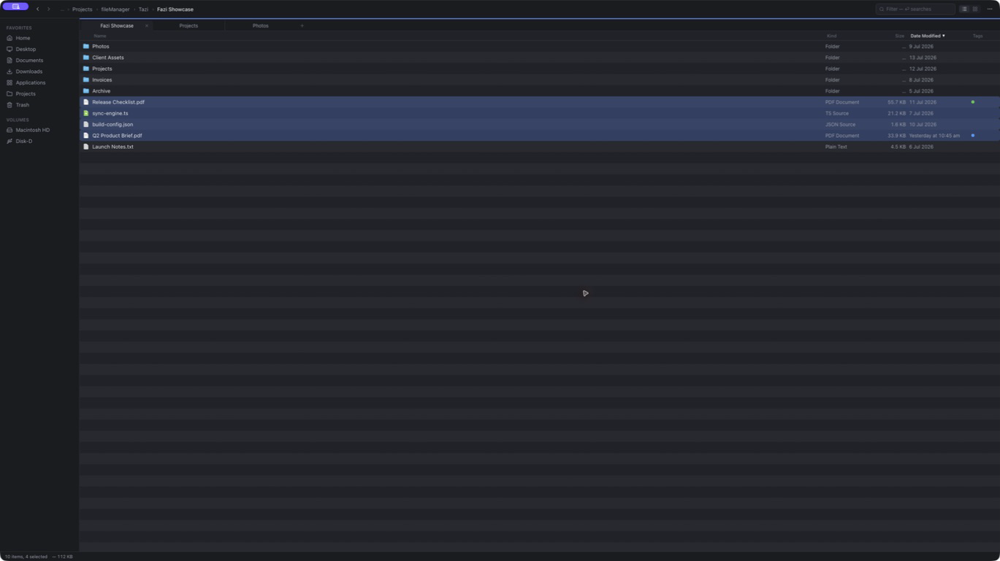
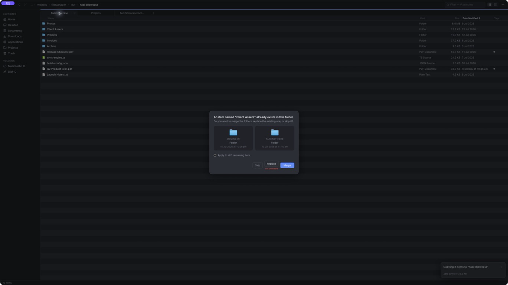
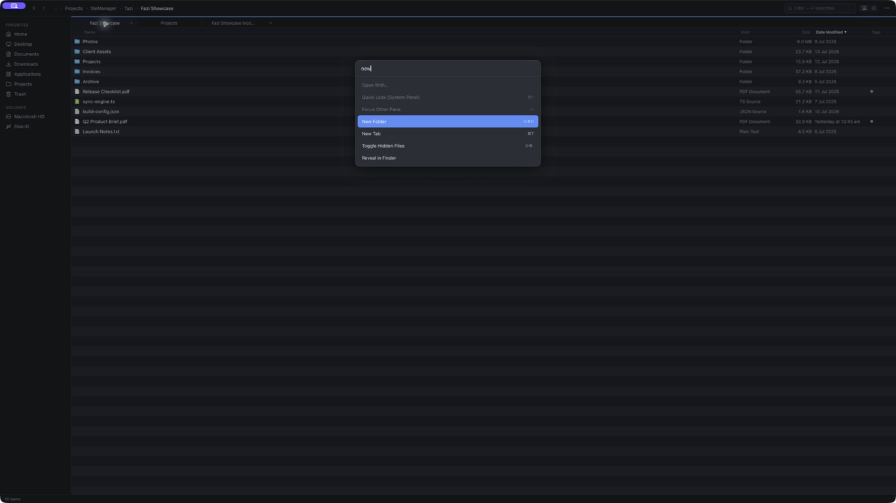
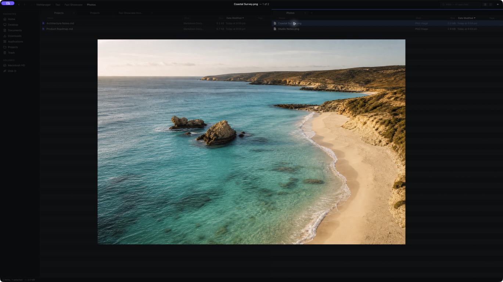

# Fazi

A keyboard-first macOS file manager built to replace Finder. Tauri 2 + React 19 + TypeScript on the front, Rust on everything that touches disk.



## Install

Download [Fazi_0.6.0_aarch64.dmg](https://github.com/Pascalrjt/Fazi/releases/download/v0.6.0/Fazi_0.6.0_aarch64.dmg) from the [latest release](https://github.com/Pascalrjt/Fazi/releases/latest) and drag Fazi to Applications.

The build isn't signed or notarized yet, so Gatekeeper blocks it on first launch. Right-click Fazi.app and choose Open, or:

```bash
xattr -d com.apple.quarantine /Applications/Fazi.app
```

Give Fazi Full Disk Access in System Settings → Privacy & Security. It's a file manager; without it, protected folders like Desktop and Documents stay out of reach. Apple Silicon only for now.

Or build from source:

```bash
git clone https://github.com/Pascalrjt/Fazi.git && cd Fazi
npm install
npm run tauri build   # DMG lands in src-tauri/target/release/bundle/dmg/
```

## Why Fazi?

Finder stalls. Copy a folder and you can sit through "Preparing to copy…" for an operation that's instant in the terminal. I built Fazi's file-operations engine around never doing that: same-volume moves are one atomic `rename(2)`, same-volume copies are APFS clones, and everything else is a staged, journaled `copyfile(3)` with real progress.

The rest of the app follows from wanting Finder's polish with a terminal user's patience for waiting, which is none.

## Features

### File operations you can kill

Every item runs an attempt ladder: rename, then APFS clone, then `copyfile(3)`. Operations go through hidden staging and an atomic promote, backed by a durable journal with startup recovery. Cross-volume moves are verified before the source is deleted. `kill -9` mid-copy never leaves a half-written file under its real name.

### Conflicts, handled properly

Keep Both, Replace, Merge, or Skip, with apply-to-all and a dialog that works like the one you already know. Merge is the default because it's the one that can't lose data. Optional BLAKE3 verification checks every copied byte if you turn it on.



### Keyboard first

Finder-parity shortcuts out of the box, custom keybindings with a recorder and conflict detection, a ⌘K command palette, and a ⌘P fuzzy finder backed by a concurrent Rust index. One command registry feeds all of it. Multi-select works everywhere: click, shift, command, marquee, type-ahead. Every operation takes the whole selection.



### Search

Streamed `mdfind` by filename or contents, with `kind:`, `date:`, and `size:` predicates. Volumes Spotlight hasn't indexed fall back to a fuzzy walker automatically.

### Big directories

A 100k-entry folder paints in under 50 ms. Listings stream in two stages and hydrate from the viewport outward, so scrolling stays smooth no matter the size.

### And the rest

Tabs and dual pane, spacebar previews through Quick Look's renderer (PDFs included), Finder tags, Open With plus per-type defaults, drag and drop in both directions, pasteboard interop with other apps, batch rename with live preview, zip and tar archives, paste clipboard images or text as files, Trash with Empty Trash, live updates from FSEvents.



## Status

Beta, v0.6.0. The daily-driver milestones in [ROADMAP.md](docs/ROADMAP.md) are done and two rounds of on-device manual testing have passed, but the app hasn't accumulated months of daily use yet. Signed and notarized builds with auto-update are next. The Mac App Store is out by design: its sandbox can't host a full-disk file manager.

## Development

```bash
npm install
npm run tauri dev      # run the app
npm test               # frontend tests (vitest)
cargo test             # Rust tests, in src-tauri/ (incl. ops-engine e2e)
npm run tauri build    # release build (DMG)
```

Grant your terminal Full Disk Access during development. TCC binds to the signing identity, so the permission follows whatever launches the dev build.

## Docs

- [ARCHITECTURE.md](docs/ARCHITECTURE.md): process split, IPC contract, ops engine design, webview threat model
- [MACOS_NOTES.md](docs/MACOS_NOTES.md): TCC, packages, aliases, dataless files, case-insensitivity, known infeasibilities
- [ROADMAP.md](docs/ROADMAP.md): milestones and open items
- [MANUAL_TESTS.md](docs/MANUAL_TESTS.md): real-device checklist
